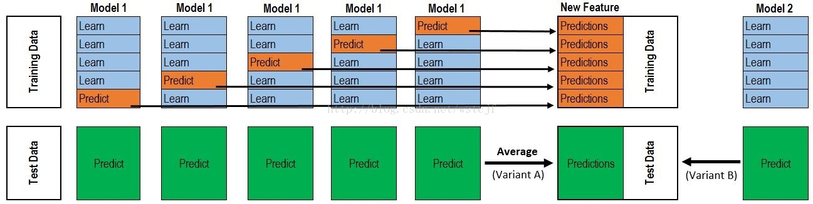

# 详解stacking processing

通过这次参加kaggle RSNA比赛,在对检测结果ensemble时，了解到
stacking是模型融合很重要的一个方法，几乎每个数据科学竞赛的前几名都会使用，
接下来我主要是介绍stacking的原理。
相信大家看很多stacking的资料都会看到下面的这个图：

stacking的过程有一张图非常经典，如下:


### 详解1

[Fork](https://blog.csdn.net/wstcjf/article/details/77989963 )
虽然他很直观，但是没有语言描述确实很难搞懂。

上半部分是用一个基础模型进行5折交叉验证，如：用XGBoost作为基础模型Model1，5折交叉验证就是先拿出四折作为
training data，
另外一折作为testing data。注意：在stacking中此部分数据会用到整个traing set。如：假设我们整个training 
set包含10000行数据，testing set包含2500行数据，那么每一次交叉验证其实就是对training set进行划分，
在每一次的交叉验证中training data将会是8000行，testing data是2000行。


每一次的交叉验证包含两个过程，1. 基于training data训练模型；2. 基于training data训练生成的模型对testing data进行预测。
在整个第一次的交叉验证完成之后我们将会得到关于当前testing data的预测值，这将会是一个一维2000行的数据，记为a1。
注意！在这部分操作完成后，我们还要对数据集原来的整个testing set进行预测，这个过程会生成2500个预测值，这部分预测值将会作为
下一层模型testing data的一部分，记为b1。因为我们进行的是5折交叉验证，所以以上提及的过程将会进行五次，最终会生成针对
testing set数据预测的5列2000行的数据a1,a2,a3,a4,a5，对testing set的预测会是5列2500行数据b1,b2,b3,b4,b5。


在完成对Model1的整个步骤之后，我们可以发现a1,a2,a3,a4,a5其实就是对原来整个training set的预测值，将他们拼凑起来，
会形成一个10000行一列的矩阵，记为A1。而对于b1,b2,b3,b4,b5这部分数据，我们将各部分相加取平均值，
得到一个2500行一列的矩阵，记为B1。


以上就是stacking中一个模型的完整流程，stacking中同一层通常包含多个模型，假设还有Model2: LR，Model3：RF，Model4:
 GBDT，Model5：SVM，对于这四个模型，我们可以重复以上的步骤，在整个流程结束之后，我们可以得到新的A2,A3,A4,A5,B2,B3,B4,B5矩阵。
在此之后，我们把A1,A2,A3,A4,A5并列合并得到一个10000行五列的矩阵作为training data，B1,B2,B3,B4,B5并列合并得到一个2500行五列
的矩阵作为testing data。让下一层的模型，基于他们进一步训练。


以上即为stacking的完整步骤！

--------------------- 


### 详解2
[Fork](https://blog.csdn.net/qq1483661204/article/details/80157365 )
首先我们将训练集使用kfold切分为k分，每一分包括一个验证集和测试集，每次取其中k-1分训练，另外的1分用来验证，stacking是这样做的，
比如对于集成的第一个模型，clf1，我们使用kfold交叉验证，那么可以得到k个clf1模型，模型的类型是一样的，但是模型里面学到的参数不一样，
因为他们的训练集是不一样的，对与每一折的训练，我们还有一个验证集啊，那么我们用训练得到的模型在验证集合上做一次预测，你想，因为这个
时候我们的验证集是不是只有1分，也就是只有train_set_number/k个样本(train_set_number表示训练样本的个数)，但是这只是一折啊，
我们还有k折，每一折我们都会在验证集上预测，所以最终对于clf1在验证集上得到是不是train_set_number个结果，不用担心是没有重复的，
因为你是kflod啊

是不是每一折的验证集样本都不会相同，也就是没有哪个样本同时出现在两个验证集上，这样下来，我们就得到第一级的结果，也是
train_set_number个结果。然后在每一折上，我们在测试集上做一次预测，那么k个clf1模型预测k次得到了k个结果，也就是每一个样本预测结果
有k个，我们就取一下平均，看到是取平均，这样取完平均以后每一个样本在clf1模型上就得到一个预测结果。这只是一个模型的过程，因为我们需要
集成很多个模型，那么我重复n个模型，做法和上面是一样的，假设我们有n个模型，那么请问我们stacking第一层出来，在验证集上得到的结果特征
是什么维度？应该就是训练样本的个数行(train_set_number),列数就是n吧，因为n个模型啊，这就是我们对第一层结果的一个特征堆叠方法，
这样第一层出来的结果又可以作为特征训练第二层，第二层任然可以使用stacking多个模型，或者直接接一个模型用于训练，然后直接预测。那么同样，
对于测试集第一层出来的维度是不是(test_set_number,n)，也就是测试集样本的行数，这样是不是可以用第二层训练的模型在这个上面预测，
得到我们最后的结果。这个就是stacking的整个过程。

然后我们看一段stacking的代码:

```python
stack_model = [svm, lr, nn, xgb, lgb]  ## 这个地方我是简写，实际这样训练会报错，需要自己导库，定义分类器
## train_data 表示训练集，train_label 表示训练集的标签，test_data表示训练集 
ntrain = train_data.shape[0] ## 训练集样本数量 
ntest = test_data.shape[0] ## 测试集样本数量 
train_stack = np.zeros(ntrain,n) ## n表示n个模型 
test_stack = np.zeros(ntest, n) ## 

kf = kfold.split(train_data, train_label) 

for i,model in enumerate(stack_model): 
    for j, (train_fold, validate) in enumerate(kf): 
        X_train, X_validate, label_train, label_validate = (
        train_data[train_fold, :], train_data[validate, :], train_label[train_fold], train_label[validate]) 
        
        model.fit(X_train,label_train) 
        train_stack[validate,i] = model.predict(X_validate) 
        test_stack[:,i] = model.predict(test_data) 
        
### 假设就只有两层，那么最后预测： 
# final_model = xgb() ## 假设第二层我们还是用xgb吧,这个地方也是简写，仅仅表示这个地方是xgb模型 
# final_model.fit(train_stack,train_label) 
# pre = final_model.predict(test_stack) 
```
--------------------- 

