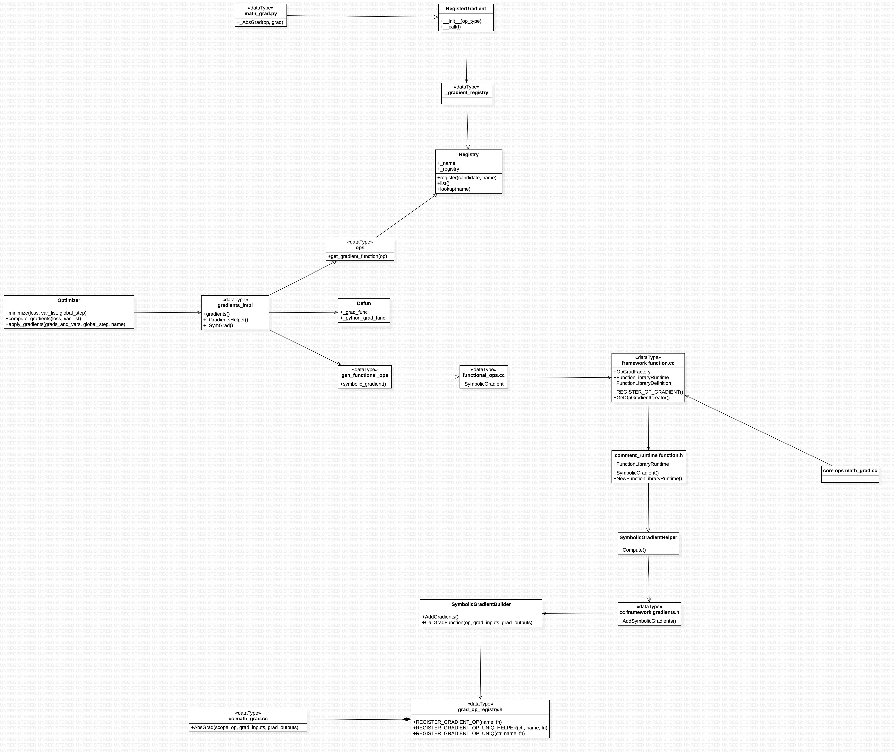
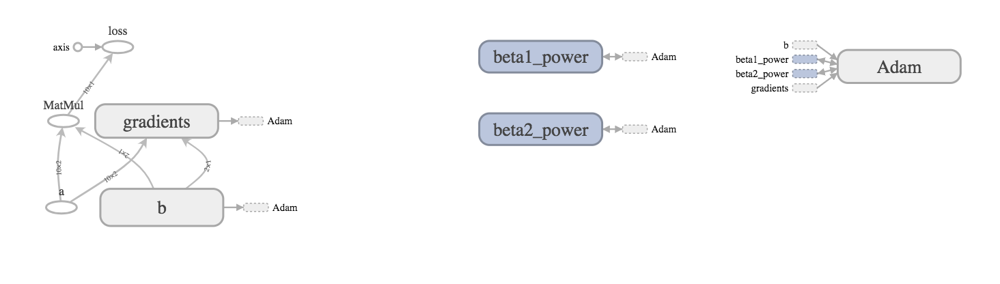
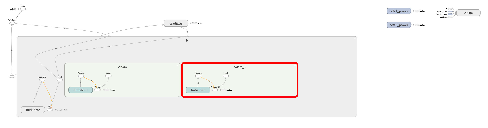
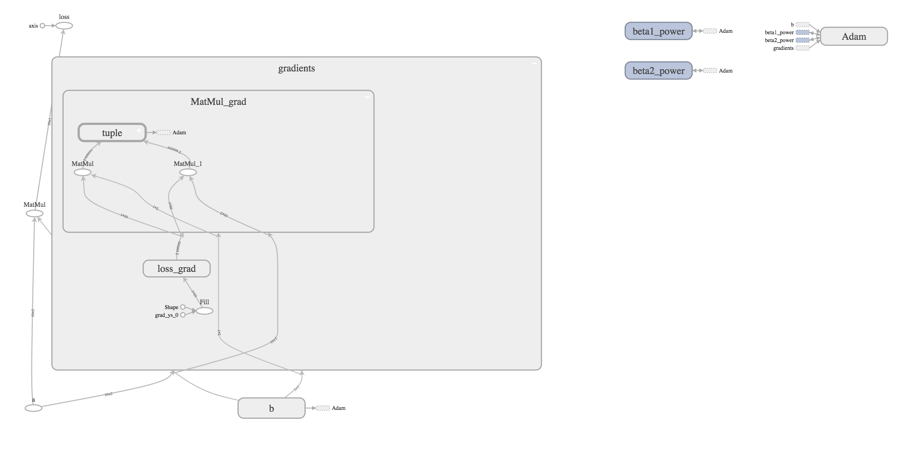
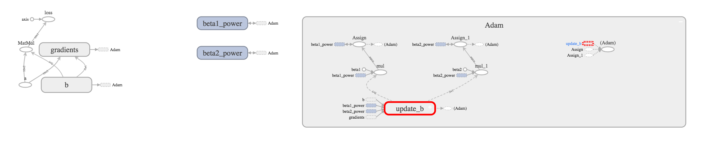

# tf.train.Optimizer - 优化器模块简介

优化器模块的逻辑结构是相对简单清晰的，它主要是针对出梯度(compute_gradients),在计算出合适的更新量，应用到对应的变量上去（apply_gradients).[官方API](https://www.tensorflow.org/api_docs/python/tf/train/Optimizer),讲的很详细.

主要结构如下:


## 有几个概念比较有意思，我尝试说下自己的理解：

   *  slots: 它们也是变量，只是依附于每个变量的一些状态信息，比如历史梯度值一类.
   +    non-slots: 优化器用于计算的全局信息.
   *  compute_gradients参数：
   +    gate_gradients: 这个把它理解成grads要不要相互同步，可能更好想.
   *  colocate_gradients_with_ops：梯度和对应算子，放在同样设备上(tf.devices).
   *  _apply_*和_resource_apply_*这些方法会被_OptimizableVariable自动调用，很多时候重载这些方法就可以，复用apply_gradients逻辑.

## Adam optimizer, TensorBoard
```python
import tensorflow as tf

# with tf.Graph().as_default()
summaries_dir = './res'
a = tf.placeholder(dtype=tf.float32, shape=[10, 2], name='a')
b = tf.get_variable('b', shape=[2, 1], dtype=tf.float32)
loss = tf.cumsum(tf.matmul(a, b), name='loss')

opt = tf.train.AdamOptimizer()
train_op = opt.minimize(loss)

with tf.Session() as sess:
    writer = tf.summary.FileWriter(summaies + '/train', sess.graph)
```
这个网络很简单，就是a乘以b，累加求和作为损失，再配上优化器寻优。用tensorboard --logdir=opt来打开，如下图:


## Adam优化器的计算逻辑见官方注释：
Initialization:

```
m_0 <- 0 (Initialize initial 1st moment vector)
v_0 <- 0 (Initialize initial 2nd moment vector)
t <- 0 (Initialize timestep)
```

The update rule for `variable` with gradient `g` uses an optimization
described at the end of section2 of the paper:

```
t <- t + 1
lr_t <- learning_rate * sqrt(1 - beta2^t) / (1 - beta1^t)

m_t <- beta1 * m_{t-1} + (1 - beta1) * g
v_t <- beta2 * v_{t-1} + (1 - beta2) * g * g
variable <- variable - lr_t * m_t / (sqrt(v_t) + epsilon)
```
首先，注意到Adam会为每个变量创建两个slots: m和v。我们展开变量b，就能看到相应的slots，它们的名字在同样空间下，分别是Adam和Adam_1:


然后,我们来看gradients是如何计算梯度的


从loss_grad来反算出MatMul_grad，从后往前反向求导。因为对于数乘$\y = a * b 来说，梯度$\da = b * dy 和$\db = a * dy，所以在梯度中有两个算子MatMul和MatMul_1，来计算相应的梯度。注意这两个梯度用tuple算子聚合在一起，这就是默认的GATE_OP行为：对于一个算子，它涉及的梯度要都解算完成。

最后再看Adam这块，它里面是update_b块，这是更新变量b的逻辑，然后再分别更新beta1_power和beta2_power变量。最后的(Adam)就是我们代码中的train_op.

所以当运行sess.run(train_op)时，整个网络就会从后往前，依次往前查找子图。再从前往后依次执行，完成一轮迭代.
